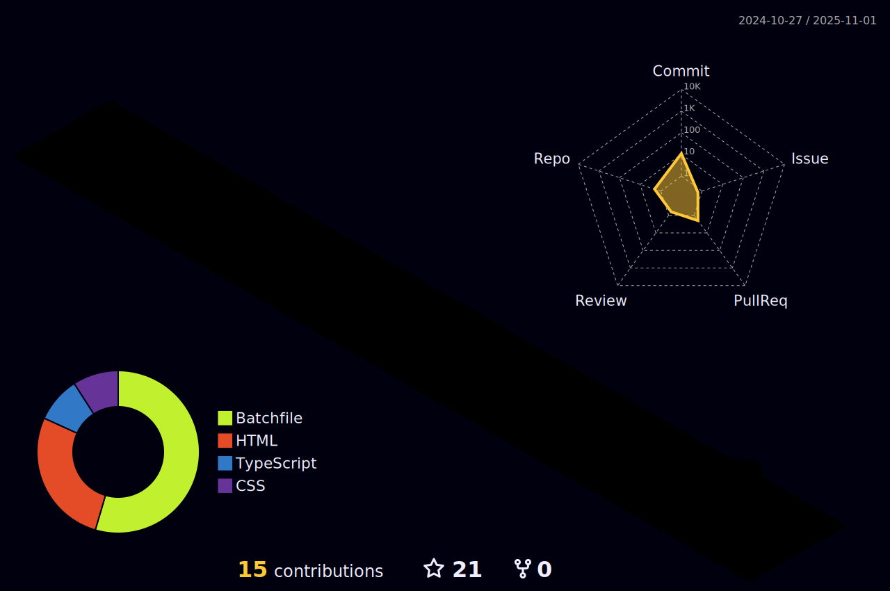

  
I'm passionate about making front-end projects. Welcome to my Github page. 

## Some of my projects:
* [QR Code Scanner](https://uahnbu.github.io/qr)

## Find me around the web 🌐:
* My Javascript performance tips and some other useful functions at [this repo](./javascript-tips.md).
* My visual arts at [Codepen](https://codepen.io/uahnbu).
* My extension *Lively Reload* for VSCode at [VS Marketplace](https://marketplace.visualstudio.com/items?itemName=uahnbu.lively-reload).
* Also, check out my GCP learning process at [Qwiklabs](https://www.qwiklabs.com/public_profiles/20eeddb8-15c9-47c2-b71d-21c9609c4da4).
